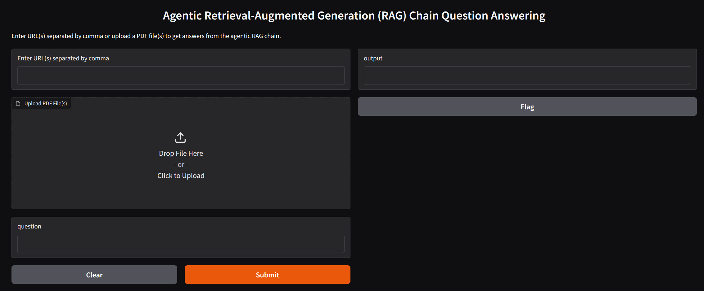

# 🤖 Agentic RAG Chain: Multi-Source Document Question Answering

## 📘 Overview

This Python script implements an advanced Retrieval-Augmented Generation (RAG) system using CrewAI, Langchain, and Gradio, enabling intelligent question-answering across multiple document sources.

## 🌟 Features

- Multi-source document processing (URLs and PDFs)
- Intelligent document retrieval
- CrewAI agent-based research and writing
- Interactive Gradio web interface

# Install Ollama using Docker

Ollama can run with GPU acceleration inside Docker containers for Nvidia GPUs.

To get started using the Docker image, please use the commands below.
CPU only

``` 
docker run -d -v /home/test/ollama:/root/ollama -p 11434:11434 --name ollama ollama/ollama
```
Nvidia GPU

- Install the Nvidia container toolkit.
- Run Ollama inside a Docker container

```
docker run -d --gpus=all -v ollama:/root/.ollama -p 11434:11434 --name ollama ollama/ollama
```

## Install python and required packages inside container
```
docker exec -it ollama /bin/bash
apt-get update
apt-get install -y python3-pip
```

```
pip install -r requirements.txt
```
Pull the model you'd like to use:

```
ollama pull llama3
```
## Run

```
cd Private_LLM
python3 privateAgentRag.py
```

The default port for Gradio is 7860, so the application can be viewed locally on URL:

```
http://127.0.0.1:7860
```

The app should look like the following screenshot 
